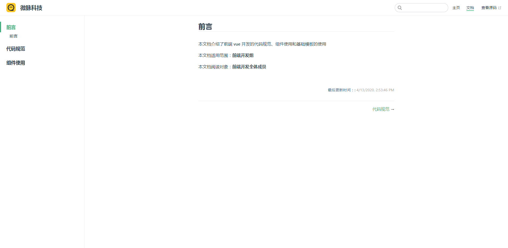

# vue项目基础模板(基于 **vue-cli** v4.2.0 构建)

## 命令配置

### 安装项目依赖
```
yarn
  or
npm i
```

### 启动项目开发环境
```
npm run dev
  or
yarn dev
```

### 打包正式开发环境
```
npm run build
  or
yarn build
```

### 打包测试开发环境
```
npm run build:test
```

### 语法检测修复
```
yarn lint
  or
npm run lint
```

### 打包体积观测
> 执行命令后会在 **public** 文件夹下生成 **report.html** 文件，直接浏览器运行该文件即可观测
```
npm run report
  or
yarn report
```

### 编译自身项目文档
```
npm run report
  or
yarn report
```

### 编译开发文档
```
开发
npm run docs:dev
发布
npm run docs:build
```


## 目录结构

- api

  - api.js : 接口请求地址

- assets： 静态资源

  - datas: 数据相关

  - images: 图片相关

  - styles: 样式相关

- 公共组件

- filters: 过滤器

- router: 路由相关

- store: 项目状态管理

- utils: 项目工具集合

  - 工具方法

  - mainfont： rem配置

  - regexp: 正则表达式相关

  - request: 请求封装

  - validator：校验方法

- views: 页面

## 路由的使用

> 根据项目功能进行分模块配置，每个模块单独一份路由表
>
> **keepAlive**： 当前路由是否需要缓存
>
> **title**： 当前路由title

``` javascript
export default [
  { // 登录
    path: '/login',
    name: 'Login',
    component: () => import('@views/login/index.vue'),
    meta: {
      keepAlive: false,
      title: '登录'
    }
  }
]
```

## 数据的处理

> 接口请求统一在store中进行处理，根据返回的数据自行判断哪些数据需要缓存
>
> 每个模块注入了接口地址和http请求方法, 可直接进行接口请求
>
> **err** 是否需要请求错误提示
>
>**loading** 是否需要loading效果
>
>**id** 给每个请求附带一个id, 用来打断接口请求
>
> vuex已集成了数据持久化，所有存入的数据，在页面刷新时不会丢失，如果清楚，需要进行mutations清除


``` javascript
// 用户信息
export default (handleRequest, API) => {
  const state = {
    user: {
      name: '张三'
    },
    dynamicList: []
  }

  const mutations = {
    SAVE_USER_INFO(state, payload = {}) {
      state.user = payload
    },

    SAVE_DYNAMIC_LIST(state, payload = []) {
      state.dynamicList = payload
    }
  }

  const getters = {}

  const actions = {
    // 保存用户信息
    saveUserInfo({commit}, data = {}) {
      commit('SAVE_USER_INFO', data)
    },

    // 获取动态列表
    dynamicList({commit}, params = {}) {
      return handleRequest.get(API["dynamic.list"], {params, err: true, loading: true,id: 'dynamic.list'}).then((data = {}) => {
        const rows = data.rows || []
        commit('SAVE_DYNAMIC_LIST', rows)
        return rows
      })
    }
  }

  return {
    namespaced: true,
    state,
    mutations,
    actions,
    getters
  }
}

```


## 添加项目常用配置项

### 添加开环境和生产环境变量
> 在 **.env** 文件中添加变量名，变量名前统一添加 **VUE_APP** 前缀

**示例**

```
VUE_APP_BASE_URLL=https://test.w618.com
```

## 其他说明

> 吐司的使用： 可以直接从vue实例调用，无需二次引入

 ```
 this.$toast('吐司内容')
 ```

## 版本发布

 ```
// 更新版本
npm version patch

// 发布至npm
npm publish
 ```
